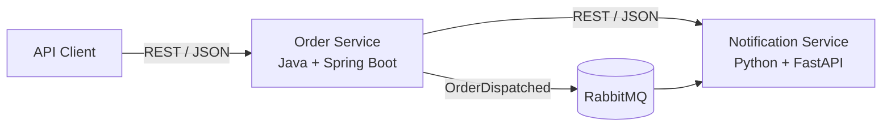

# Microservices & REST API für Entwickler

## Von einem laufenden Java-Service zur belastbaren Service-Landschaft

**Drei Tage · 09:00–16:30 · individuelle Labs**

---
# Das Kursergebnis

Nach drei Tagen können die Teilnehmenden:

- einen vorhandenen Java-Service bauen, starten, testen und verändern,
- Servicegrenzen anhand fachlicher und betrieblicher Kriterien begründen,
- REST APIs und Fehlerfälle konsistent entwerfen,
- OpenAPI als überprüfbaren Vertrag einsetzen,
- Java und Python synchron integrieren,
- REST und Messaging bewusst auswählen,
- Java, FastAPI und RabbitMQ mit Docker Compose betreiben,
- verteilte Fehler diagnostizieren und nächste Produktionsschritte priorisieren.

Das sichtbare Ergebnis ist eine lokal ausführbare Referenzarchitektur mit überprüfbaren Schnittstellen und dokumentierten Entscheidungen.

---
# Vorstellungsrunde

Bitte stellen Sie sich kurz vor:

- Name und aktuelle Rolle
- beruflicher Hintergrund und heutige Aufgaben
- Weg in das aktuelle Arbeitsfeld
- Unternehmen oder Organisation und Dauer der Zugehörigkeit
- Stadt oder Region; lokales Wetter als freiwilliger Einstieg
- bisherige Erfahrung mit Microservices und REST APIs
- Erwartungen an das Seminar
- Projekt, Use Case oder Arbeitsaufgabe für den Transfer

Persönliche Angaben sind freiwillig. Jeder Punkt darf übersprungen werden.

---
# Unser Szenario

Eine Bestell- und Lieferplattform wächst aus einer eng gekoppelten Anwendung zu einer kleinen Service-Landschaft.

- **Order Service:** nimmt Bestellungen an und steuert den Ablauf.
- **Notification Service:** verarbeitet Benachrichtigungen und Ereignisse.
- **RabbitMQ:** entkoppelt den späteren Ereignisfluss.
- **Docker Compose:** startet und verbindet die Landschaft reproduzierbar.

---
# Der Lernpfad

| Modul | Leitfrage | Sichtbares Ergebnis |
| --- | --- | --- |
| M01 Code zuerst | Läuft der vorhandene Service reproduzierbar? | API-Aufruf, grüner Test, erste Änderung |
| M02 Servicegrenzen | Welche Trennung ist fachlich vertretbar? | Context Map und Entscheidung |
| M03 REST und OpenAPI | Wie wird die Grenze zu einem Vertrag? | validierter API-Vertrag |
| M04 Java und Python | Bleibt die Kommunikation sprachunabhängig? | erfolgreicher Vertical Slice |
| M05 REST oder Ereignis | Welche Kopplung passt zur Interaktion? | RabbitMQ-Fluss und Trade-off |
| M06 Docker Compose | Wie läuft die Landschaft reproduzierbar? | gesunde Service-Landschaft |
| M07 Tests und Resilienz | Welcher Test deckt welches Risiko? | Diagnose und getestete Kontrolle |
| M08 Produktionsreife | Was fehlt für einen verantwortbaren Betrieb? | priorisierter Verbesserungsplan |

---
# Tag 1: Code und Verträge

**Ziel:** Der Java-Service läuft und kommuniziert noch am selben Tag mit FastAPI.

1. Starterprojekt bauen, starten und testen
2. Kopplung untersuchen und Servicegrenzen begründen
3. REST-Ressourcen, Statuscodes und Fehlerfälle entwerfen
4. OpenAPI-Vertrag prüfen
5. Java-Endpunkt und vorbereiteten Python-Service verbinden

**Tagescheckpoint:** Java und Python tauschen im Erfolgsfall vertragstreue Daten aus.

---
# Tag 2: Integration und Betrieb

**Ziel:** Der synchrone Pfad wird abgesichert und um Messaging ergänzt.

1. positive und negative Vertragstests ausführen
2. Fehlerantworten über Servicegrenzen behandeln
3. REST und Ereignisse anhand von Kopplung vergleichen
4. `OrderDispatched` über RabbitMQ publizieren und konsumieren
5. Java, Python und RabbitMQ mit Docker Compose betreiben

**Tagescheckpoint:** Die vollständige Landschaft startet reproduzierbar und der Ereignisfluss ist sichtbar.

---
# Tag 3: Diagnose und Entscheidungen

**Ziel:** Die laufende Landschaft wird gezielt gestört, diagnostiziert und bewertet.

1. Status und Logs zur Ursachenanalyse einsetzen
2. Unit-, Vertrags-, Integrations- und End-to-End-Tests zuordnen
3. Timeout, Wiederholung, Duplikat oder Teilausfall untersuchen
4. eine passende Resilienzmaßnahme prüfen
5. Skalierung, Delivery und Produktionsreife bewerten

**Abschluss:** Jede Person priorisiert Risiken und nächste Schritte für die eigene Lösung.

---
# Arbeitsweise

- Kurze Theorieimpulse werden unmittelbar angewendet.
- Alle Pflichtübungen erzeugen einen überprüfbaren Checkpoint.
- Der Basispfad ist für die gemeinsame Kursprogression verbindlich.
- Erweiterungen vertiefen Python, Fehlerfälle oder Architekturentscheidungen.
- Erweiterungen sind keine Voraussetzung für spätere Pflichtmodule.
- Entscheidungen werden anhand von Kriterien begründet, nicht anhand von Technologiepräferenzen.

Die Referenzlösung dient der Prüfung und Wiederherstellung. Gearbeitet wird im Starterprojekt.

---
# Technische Umgebung

| Komponente | Kursbasis |
| --- | --- |
| Java | Java 21 LTS |
| Java-Framework | Spring Boot 4.1.1 |
| Python | Python 3.12 |
| Python-Framework | FastAPI 0.141.1 |
| Messaging | RabbitMQ 4.3.5 |
| Laufzeit | Docker Compose v2 |

Benötigte lokale Ports: `8080`, `8000`, `5672` und `15672`.

Der Pflichtpfad läuft lokal mit anonymisierten Beispieldaten und ohne externe Konten.

---
# Erster technischer Checkpoint

Im ersten Lab wird der vorhandene Java-Service:

1. gebaut,
2. getestet,
3. gestartet,
4. über seine API aufgerufen,
5. mit einer kleinen getesteten Änderung versehen.

**Fertig bedeutet:** Der Service antwortet, der Test ist grün und die Änderung ist nachvollziehbar gesichert.

---
# Bewusste Grenzen

Der Kurs ist kein vollständiger Docker-, Kubernetes- oder CI/CD-Kurs.

- Docker wird für Build, Start, Konfiguration, Vernetzung, Status und Logs eingesetzt.
- Cloud-Skalierung wird verglichen, aber nicht verpflichtend implementiert.
- Monitoring wird als Produktionsanforderung bewertet; ein eigener Monitoring-Stack ist nicht Teil des Labs.
- Python ist ein vorbereiteter Integrationsservice. Eigene Python-Änderungen bleiben eine Erweiterung.
- Microservices sind eine Architekturentscheidung, kein automatisches Zielbild.

---
# Checkpoints über drei Tage

- Coding-Start
- Architekturentscheidung
- begründete Servicegrenzen
- gültiger API-Vertrag
- Java-Python-Interoperabilität
- nachvollziehbarer Messaging-Fluss
- reproduzierbare Compose-Landschaft
- Test- und Resilienzbefund
- individuelles Produktionsreife-Review

Die Checkpoints dienen dem formativen Feedback. Sie sind keine externe Zertifizierungsprüfung.

---

# Transferfrage

Welche eine Schnittstelle oder Kopplung in Ihrem aktuellen System würden Sie nach diesem Kurs zuerst untersuchen?

Notieren Sie:

- den fachlichen Anlass,
- die beteiligten Verantwortungen,
- das aktuell größte Risiko,
- die Evidenz, die Sie für eine Entscheidung benötigen.