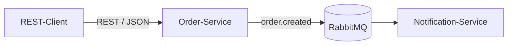

# Microservices und REST API für Entwickler

## Von Servicegrenzen zur containerisierten Bestell-Plattform

**Drei Tage · 09:00-16:30 · Java- oder Python-Spur**

---
# Das Kursergebnis

Nach drei Tagen könnt ihr in eurer gewählten Sprache (Java/Spring Boot oder Python/FastAPI):

- eine Microservices-Architektur begründet von einem Monolithen abgrenzen und Servicegrenzen benennen,
- eine RESTful API mit OpenAPI/Swagger vertraglich beschreiben und implementieren,
- Skalierungsentscheidungen (horizontal/vertikal, Cloud) begründen,
- asynchrone Kommunikation mit RabbitMQ umsetzen und gegen REST abwägen,
- einen Service containerisieren und die Plattform mit Docker Compose orchestrieren,
- Testarten, Resilienzmuster, Monitoring/Logging und eine Deployment-Strategie bewerten.

Das sichtbare Ergebnis: eine lokal lauffähige, containerisierte Bestell-Plattform mit dokumentierter REST- und Ereigniskommunikation, nachgewiesener Resilienz und einer begründeten Deployment-Entscheidung.

---
# Vorstellungsrunde

Bitte teilt kurz:

- Name und aktuelle Rolle
- beruflicher Hintergrund und heutige Aufgaben
- Weg in das aktuelle Arbeitsfeld
- Unternehmen/Organisation und Zugehörigkeitsdauer
- Stadt/Region; lokales Wetter als freiwilliger Einstieg
- bisherige Erfahrung mit Microservices, REST APIs oder Messaging
- Erwartungen an das Seminar
- ein Projekt, ein Use Case oder eine Arbeitsaufgabe für den Transfer

Persönliche Angaben sind freiwillig - jeder Punkt darf übersprungen werden.

---
# Zielgruppe und Voraussetzungen

- Softwareentwickler:innen, Foundation- bis Intermediate-Niveau im Bereich Microservices.
- Programmiergrundkenntnisse und Vertrautheit mit Webservice-/API-Konzepten (z. B. REST, SOAP) werden vorausgesetzt.
- Praktische Vorerfahrung in mindestens einer der beiden Kurssprachen (Java oder Python) - tiefe Erfahrung in beiden ist nicht nötig.
- Docker lokal lauffähig, Zugriff auf öffentliche Paket-Repositories (Maven Central, PyPI); Preflight-Check vor Kursbeginn empfohlen.

---
# Unser Szenario: die Bestell-Plattform

- **Order-Service:** nimmt Bestellungen entgegen, validiert sie und veröffentlicht ein Ereignis.
- **Notification-Service:** konsumiert das Ereignis und protokolliert eine Benachrichtigung.
- **RabbitMQ:** entkoppelt Order- und Notification-Service zeitlich.
- **Docker Compose:** startet und verbindet die gesamte Landschaft reproduzierbar (ab Modul 8).

---
# Zwei Sprachspuren, ein Szenario

Jede/r Teilnehmende wählt zu Kursbeginn **eine** Spur (Java/Spring Boot oder Python/FastAPI) und bleibt für alle drei Tage darin. Beide Spuren implementieren dasselbe Szenario mit vergleichbarem Lernziel, Aufwand und Checkpoint-Kriterium.

**Ordnerkonvention der Materialien:** Labs zu Architektur, Skalierung und Event-Driven-Konzepten (z. B. Module 1.1-1.2, 4, 5) sind sprachneutral und liegen direkt im Lab-Ordner. Implementierungsnahe Labs (z. B. Module 2, 3, 6, 7, 8, 9) liegen je einmal unter `java/` und einmal unter `python/` im selben Lab-Ordner - nutzt nur den Unterordner eurer gewählten Spur.

---
# Der Lernpfad

| Modul | Leitfrage | Sichtbares Ergebnis |
| --- | --- | --- |
| M1 Grundlagen und Architektur | Wodurch unterscheidet sich ein Microservice-System von einem Monolithen? | Servicegrenzen, lauffähiges Starterprojekt |
| M2 REST-API-Design und Implementierung | Wie wird eine REST-Schnittstelle konsistent gestaltet? | Validierte REST-API für den Order-Service |
| M3 API-Dokumentation mit OpenAPI/Swagger | Wie wird die API nachvollziehbar dokumentiert? | Swagger UI, generierter Client |
| M4 Skalierung und Lastverteilung | Wann skaliert man horizontal, wann vertikal? | Begründete Skalierungsentscheidung |
| M5 Event-Driven Architecture | Wann lohnt sich Ereigniskommunikation? | Entworfener Ereignisvertrag |
| M6 Messaging mit RabbitMQ | Wie werden Ereignisse zuverlässig übertragen? | Order↔Notification über RabbitMQ |
| M7 Containerisierung mit Docker | Wie wird ein Service reproduzierbar containerisiert? | Gebautes, startfähiges Image |
| M8 Orchestrierung mit Docker Compose | Wie wird die Landschaft gemeinsam orchestriert? | Plattform startet über `docker compose up` |
| M9 Tests, Resilienz, Deployment | Welche Testarten, Resilienzmuster, Deployment-Strategie passen? | Resilienznachweis, Abschlussdemonstration |

---
# Tag 1: Grundlagen und REST-API

**Ziel:** begründete Servicegrenzen und eine validierte, dokumentierte REST-API für den Order-Service.

1. Microservices von Monolithen begründet abgrenzen (M1)
2. Servicegrenzen entwerfen, Startercode lauffähig einrichten (M1)
3. REST-Vertrag entwerfen und implementieren, validieren und testen (M2)
4. OpenAPI-Spezifikation erzeugen, Swagger UI prüfen, Client generieren (M3)

**Tagescheckpoint:** Order-Service läuft lokal und ist über Swagger UI mit generiertem Client nutzbar.

---
# Tag 2: Skalierung und asynchrone Kommunikation

**Ziel:** begründete Skalierungsentscheidung; Notification-Service reagiert sichtbar auf ein RabbitMQ-Ereignis.

1. Skalierungsarten einordnen, Load Balancing beobachten, Entscheidung dokumentieren (M4)
2. Synchron/asynchron unterscheiden, Ereignisvertrag entwerfen, Trade-offs bewerten (M5)
3. RabbitMQ einrichten, publizieren, konsumieren, End-to-End-Fluss inkl. Fehlerfall testen (M6)

**Tagescheckpoint:** Order- und Notification-Service kommunizieren nachweislich asynchron über RabbitMQ.

---
# Tag 3: Container, Resilienz, Abschluss

**Ziel:** reproduzierbar orchestrierte Plattform, nachgewiesenes Resilienzmuster, begründete Deployment-Entscheidung.

1. Dockerfile lesen, eigenes Dockerfile schreiben, Image bauen und starten (M7)
2. Compose-Datei erstellen, Stack starten, Checkpoint verifizieren (M8)
3. Testarten zuordnen, Resilienzmuster implementieren und per Fehlerinjektion testen, Monitoring-Konzept skizzieren, Deployment-Strategie wählen und Gesamtsystem demonstrieren (M9)

**Abschluss:** Jede Person demonstriert die vollständige Plattform und hält in `output/project/capstone-summary.md` fest, wie alle sechs Lernziele im eigenen Projektstand sichtbar wurden.

---
# Arbeitsweise und Aufgabenformen

- Jedes Lab enthält `theory.md` (Input), `exercise.md` (Aufgabe) und `solution.md` (vollständige Lösung mit Begründung).
- **Baseline** ist für alle Teilnehmenden verpflichtend; **Erweiterung** ist optional und für schnellere Teilnehmende gedacht - nie Voraussetzung für Pflichtinhalte.
- Aufgabentypen wechseln bewusst: kurze Einordnungsübungen, angeleitete Implementierungs-Labs, Diagnose-/Sandbox-Übungen, Diskussionen und Projekt-Labs, die die gemeinsame Plattform weiterbauen.
- Nicht jedes Lab verändert die Bestell-Plattform - Sandbox-Übungen (z. B. M4-L2) sind ausdrücklich reversibel und ohne Dauerwirkung.

---
# Umgebung und Sicherheit

- JDK 17 + Maven (Java-Spur) bzw. aktuelle Python-Version mit venv/pip (Python-Spur); Docker und Docker Compose lokal lauffähig.
- Alle Beispieldaten sind fiktiv; keine echten Kunden- oder Produktionsdaten, keine geheimen Zugangsdaten im Code.
- Der lokale RabbitMQ-Zugang (`kodschul`/`kodschul`) ist ein Trainings-Platzhalter für die nicht im Internet erreichbare Kursumgebung - kein produktiv nutzbares Geheimnis.
- Sensible oder destruktive Aktionen (z. B. Cloud-Deployment) werden nur konzeptionell besprochen, nicht praktisch mit echten Cloud-Ressourcen durchgeführt.
- Bei Docker- oder RabbitMQ-Problemen: meldet euch frühzeitig - vorbereitete Fallbacks (Images, Aufzeichnungen) stehen bereit.
