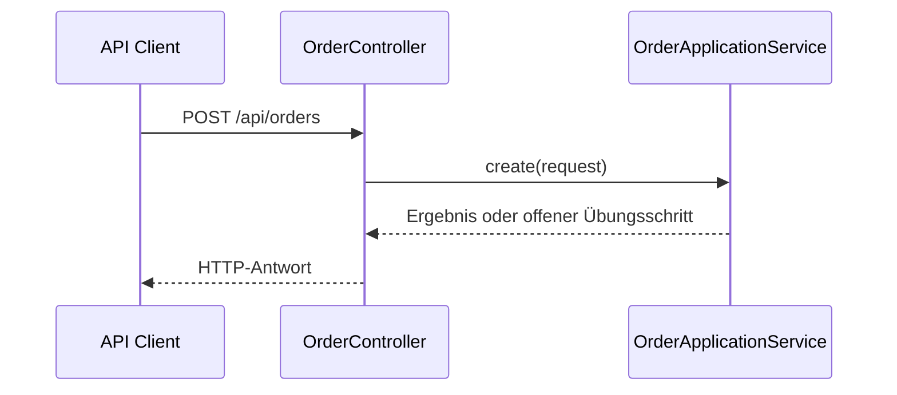

# M01: Code zuerst

## Einen vorhandenen Service belastbar starten

**Ergebnis:** Der Order Service ist gebaut, getestet, erreichbar und gezielt verändert.

---

# Leitfragen

- Welche Teile des Projekts steuern Build, Start und Laufzeit?
- Woran erkennen wir das aktuelle API-Verhalten?
- Wie sichern wir eine kleine Änderung gegen Regressionen ab?
- Welche Beobachtungen tragen die spätere Architekturentscheidung?

---

# Das Starterprojekt lesen

| Bereich | Aufgabe |
| --- | --- |
| `pom.xml` | Java-Version, Abhängigkeiten und Build |
| `src/main/java` | Anwendung, Controller und Fachlogik |
| `src/main/resources` | Laufzeitkonfiguration |
| `src/test/java` | ausführbare Verhaltenserwartungen |
| `Dockerfile` | reproduzierbarer Image-Build |

Leserichtung: zuerst den Einstiegspunkt finden, dann den Request vom Controller bis zur Fachlogik verfolgen.

---

# Der erste vertikale Pfad

Der Starter ist absichtlich unvollständig. Ein `501 Not Implemented` ist deshalb zunächst ein erwartbarer, beobachtbarer Zustand und kein Setupfehler.

---

# Build, Test und Start unterscheiden

- **Build:** übersetzt Quellcode und erzeugt ein ausführbares Artefakt.
- **Test:** prüft eine konkrete Verhaltenserwartung automatisch.
- **Start:** führt die Anwendung mit Laufzeitkonfiguration aus.
- **API-Aufruf:** prüft Verhalten an der öffentlichen Grenze.

Ein erfolgreicher Build beweist weder korrekte Fachlogik noch eine erreichbare API.

---

# Kleine Änderungen, kurze Rückkopplung

Eine belastbare Änderung folgt einem engen Zyklus:

1. aktuelles Verhalten beobachten,
2. genau eine Erwartung formulieren,
3. Test oder reproduzierbaren Aufruf festlegen,
4. kleinste Änderung umsetzen,
5. denselben Nachweis erneut ausführen.

So bleibt sichtbar, welche Änderung welches Verhalten verursacht hat.

---

# Fehlerbild: Build grün, Service rot

Mögliche Ursachen:

- Port `8080` ist bereits belegt,
- die erwartete Java-Version fehlt,
- eine Laufzeitabhängigkeit ist nicht erreichbar,
- die Konfiguration verweist auf eine falsche Adresse,
- der Prozess startet und beendet sich sofort.

Diagnose beginnt mit Prozessstatus und Logs, nicht mit zufälligen Codeänderungen.

---

# Checkpoint vor der Übung

Der Startzustand ist verstanden, wenn Sie zeigen können:

- wo die Anwendung startet,
- wo `/api/orders` definiert ist,
- warum der Starter zunächst `501` liefern darf,
- welcher Test nach der ersten Änderung grün werden soll.

**Nächster Schritt:** Service ausführen, Verhalten sichern und die erste kleine Fachänderung implementieren.