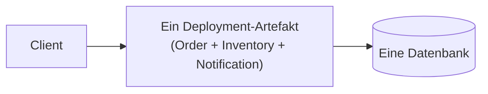
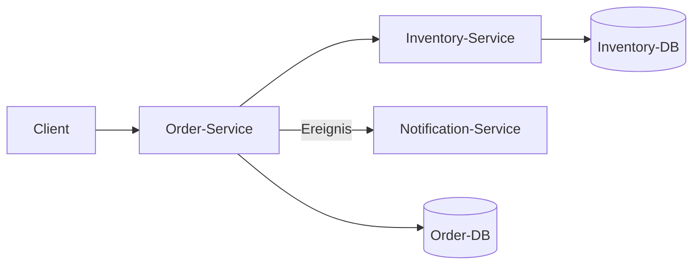

# Lab 1: Monolith vs. Microservices vergleichen

## Lernziel

Nach diesem Lab könnt ihr für ein gegebenes Softwaresystem begründet einordnen, ob eine monolithische oder eine Microservices-Architektur besser passt, und die zentralen Unterschiede benennen.

## Leitfragen

1. Was unterscheidet einen Monolithen strukturell von einer Microservices-Architektur?
2. Welche Vorteile bringt die Aufteilung in Services, welche Kosten entstehen dadurch?
3. Wann überwiegt der Nutzen, wann die Kosten?

## Monolith: Ein Programm, eine Verantwortung für alles

Ein **Monolith** ist eine Anwendung, die als ein zusammenhängendes Deployment-Artefakt gebaut, getestet und ausgeliefert wird. Bestellannahme, Bestandsprüfung und Benachrichtigung laufen im selben Prozess, teilen sich Datenbank, Speicher und Lebenszyklus.

**Vorteile:** einfaches Deployment, einfache lokale Entwicklung, keine Netzwerklatenz zwischen den Teilen, ein Transaktionskontext.

**Nachteile:** Skalierung nur als Ganzes möglich, ein Fehler kann die gesamte Anwendung mitreißen, Teams stören sich gegenseitig bei parallelen Änderungen, Technologie-Stack ist für alle Teile gleich.

## Microservices: mehrere unabhängig deploybare Services

Bei **Microservices** wird die Anwendung in mehrere kleine, unabhängig deploybare Services aufgeteilt, die jeweils eine klar begrenzte fachliche Verantwortung tragen (Order, Inventory, Notification) und über Netzwerkaufrufe (REST, Messaging) kommunizieren.

**Vorteile:** unabhängige Skalierung, unabhängiges Deployment, Technologiefreiheit je Service, Fehler bleiben eher lokal begrenzt.

**Nachteile:** verteilte Systeme sind komplexer zu betreiben und zu debuggen, Netzwerklatenz und -ausfälle müssen behandelt werden, Datenkonsistenz über Servicegrenzen hinweg ist schwieriger, mehr Betriebsaufwand (mehr Deployments, mehr Monitoring).

## Wann lohnt sich der Wechsel?

| Kriterium | Eher Monolith | Eher Microservices |
| --- | --- | --- |
| Teamgröße | 1 kleines Team | mehrere Teams, die unabhängig arbeiten wollen |
| Skalierungsbedarf | gleichmäßig über die Anwendung | stark unterschiedlich je Teilbereich |
| Änderungsfrequenz | insgesamt niedrig/mittel | einzelne Teile ändern sich sehr unterschiedlich häufig |
| Betriebsreife | wenig Infrastruktur/Erfahrung vorhanden | Container-, Monitoring- und CI/CD-Erfahrung vorhanden |
| Fehlertoleranz-Anforderung | ein Ausfall darf alles stoppen | Ausfälle müssen isoliert bleiben |

**Wichtig:** Microservices sind kein Selbstzweck. Sie lösen organisatorische und Skalierungsprobleme, erzeugen aber zusätzliche Betriebskomplexität. Ein gut strukturierter Monolith ist oft die bessere Wahl für kleine Teams und geringe Skalierungsanforderungen.

## Checkpoint

Ihr könnt für ein gegebenes System die Kriterien aus der Tabelle anwenden und eine begründete Empfehlung abgeben. Weiter geht es im Lab mit einem konkreten Vergleichsauftrag.
