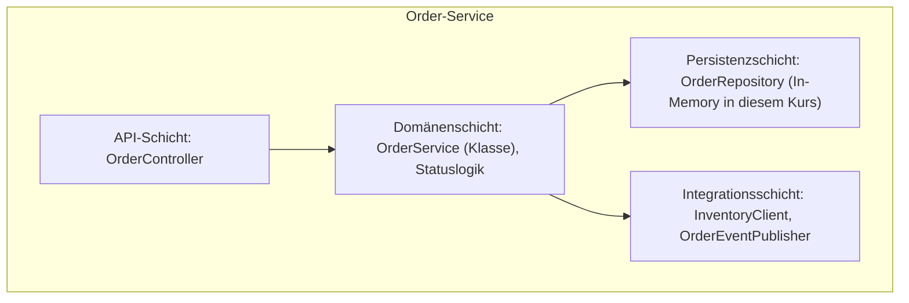

# Lösung: Servicegrenzen für die Bestell-Plattform entwerfen

## Aufgabe 1: Komponenten

## Aufgabe 2: Servicegrenzen-Tabelle

| Service | Fachliche Verantwortung | Eigene Daten? | Änderungsgrund (Beispiel) |
| --- | --- | --- | --- |
| Order | Bestellungen entgegennehmen, Status verwalten, REST-API bereitstellen | Ja | Ein neues Pflichtfeld "Lieferadresse" wird eingeführt |
| Inventory | Lagerbestand prüfen und reservieren | Ja | Eine neue Regel "Reservierung läuft nach 15 Minuten ab" |
| Notification | Teilnehmende über Bestellereignisse informieren | Ja (z. B. Vorlagen, Versandhistorie) | Ein neuer Kanal wie Push-Benachrichtigungen kommt hinzu |

## Aufgabe 3: Kommunikationsentscheidung

- **Order ↔ Inventory: synchron (REST).** Die Bestellannahme muss unmittelbar wissen, ob genug Bestand vorhanden ist, bevor sie die Bestellung bestätigt - eine sofortige Antwort ist fachlich notwendig.
- **Order → Notification: asynchron (Ereignis).** Die Benachrichtigung ist nicht zeitkritisch für die Bestellannahme; ein Ausfall der Benachrichtigung darf die Bestellung nicht blockieren. Das entspricht dem "Fire-and-forget"-Muster über RabbitMQ (Details in Modul 5/6).

## Aufgabe 4: Anti-Pattern-Beispiel

Ein Zuschnitt "Datenbank-Service" (ein Service, der nur CRUD-Operationen für alle Tabellen anbietet) wäre ein Anti-Pattern: Er hat keine eigene fachliche Verantwortung, sondern bündelt technische Zugriffe für mehrere fachliche Bereiche. Jede fachliche Änderung (z. B. neue Bestellregel) würde diesen einen Service betreffen, obwohl sie inhaltlich zu Order gehört - das erzeugt genau die Kopplung, die Microservices vermeiden sollen.
