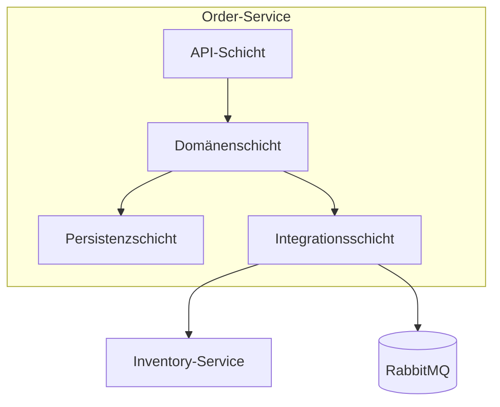

# Lab 2: Architektur, Komponenten und Servicegrenzen

## Lernziel

Nach diesem Lab könnt ihr für die Bestell-Plattform begründete Servicegrenzen entwerfen und wisst, welche Komponenten ein einzelner Microservice typischerweise enthält.

## Leitfragen

1. Aus welchen Komponenten besteht ein typischer Microservice?
2. Wie erkennt man eine gute Servicegrenze?
3. Welche fachlichen Verantwortungen hat die Bestell-Plattform, und wie schneidet man sie in Services?

## Komponenten eines Microservice

Ein einzelner Service besteht üblicherweise aus:

| Schicht | Aufgabe | Beispiel im Order-Service |
| --- | --- | --- |
| API-Schicht | nimmt Anfragen entgegen, validiert Eingaben, formt Antworten | REST-Controller für `/orders` |
| Anwendungs-/Domänenschicht | enthält die fachliche Logik | Bestellung anlegen, Status prüfen |
| Persistenzschicht | speichert und lädt Zustand | Order-Repository, eigene Datenbank |
| Integrationsschicht | kommuniziert mit anderen Services | REST-Client zu Inventory, Publisher zu RabbitMQ |

## Servicegrenzen erkennen

Eine gute Servicegrenze folgt der **fachlichen Verantwortung**, nicht der technischen Schicht. Faustregeln:

- Ein Service besitzt seine Daten allein; kein anderer Service greift direkt auf seine Datenbank zu.
- Ein Service ändert sich aus einem einzigen fachlichen Grund (single responsibility auf Service-Ebene).
- Häufig gemeinsam geänderte Funktionalität gehört eher in denselben Service; selten gemeinsam geänderte Funktionalität darf getrennt werden.
- Kommunikation zwischen Services läuft über einen klar definierten Vertrag (REST-Endpunkt, Ereignis), nie über gemeinsame Datenbanktabellen.

## Servicegrenzen der Bestell-Plattform

| Service | Fachliche Verantwortung | Typische Änderungsgründe |
| --- | --- | --- |
| **Order** | Bestellungen anlegen, anzeigen, Status verwalten | neue Bestellfelder, neue Statuswerte, REST-Vertrag |
| **Inventory** | Bestand prüfen und reservieren | Lagerlogik, Reservierungsregeln |
| **Notification** | Teilnehmende über Bestellereignisse informieren | neue Kanäle (E-Mail, Push), Nachrichtentexte |

Der Order-Service ist im Kurs der Hauptservice, den ihr implementiert. Inventory bleibt in diesem Kurs eine **konzipierte, aber nicht implementierte** Servicegrenze - ihr benennt die Verantwortung und Schnittstelle, baut den Code aber nicht. Notification wird ab Modul 6 implementiert.

## Checkpoint

Ihr könnt für ein gegebenes fachliches Problem prüfen, ob ein Servicezuschnitt sinnvoll ist (eine Verantwortung, eigene Daten, klarer Vertrag) oder ob er eher zu Kopplung führt.
