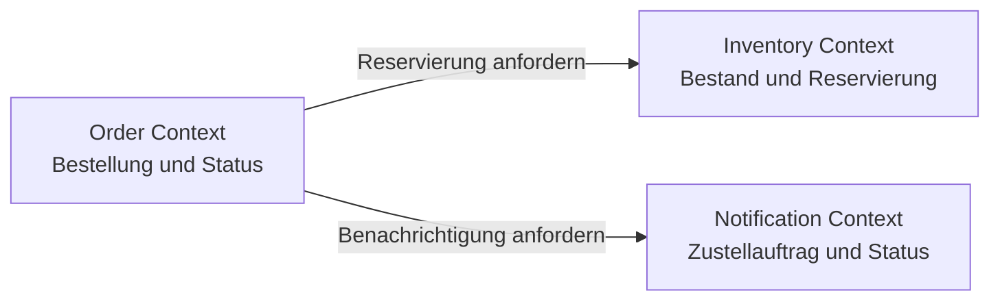

# Lösung M02: Servicegrenzen begründen

## Szenario und Ziel

Die Musterlösung trennt Order, Inventory und Notification als fachliche Kontexte. Der Zuschnitt ist eine begründete Variante; ein modularer Monolith bleibt bei anderen Team- und Betriebsbedingungen gültig.

**Dauer:** 75 Minuten
**Zielartefakt:** Context Map mit Verantwortungen, Datenhoheit, Beziehungen und einem kurzen Entscheidungsprotokoll

## Voraussetzungen

- abgeschlossener M01-Stand
- bereitgestellter Quellcode des Order Service
- Context-Map- oder Diagrammvorlage
- Notizfläche für Kriterien und Alternativen

## Aufgabe 1: Kopplung im Ausgangspunkt markieren

| Stelle | Einordnung | Auswirkung |
| --- | --- | --- |
| Bestellerstellung entscheidet über Bestellstatus | fachlich | Order-Regeln sind mit Folgeaktionen verbunden |
| Bestellablauf benötigt Benachrichtigungsstatus | fachlich und technisch | Ausfall eines Folgesystems beeinflusst die Antwort |
| Service kennt Adresse des Notification Service | technisch | Laufzeitkonfiguration und Netz werden Teil des Pfads |

Der Request läuft vom Controller in die Anwendungslogik und von dort über einen Client zur Benachrichtigung. Damit ist die Laufzeitkopplung konkret sichtbar.

**Checkpoint:** Drei Kopplungsstellen sind einschließlich ihrer Auswirkung dokumentiert.

## Aufgabe 2: Fähigkeiten und Datenhoheit ordnen

| Kontext | Verantwortung | Eigene Regeln | Eigene veränderbare Daten |
| --- | --- | --- | --- |
| Order | Bestellung annehmen und Status führen | gültige Bestellung, Statusübergänge | Bestellung und Bestellstatus |
| Inventory | Bestand prüfen und reservieren | verfügbare Menge, Reservierungsregeln | Bestand und Reservierung |
| Notification | Zustellauftrag annehmen | Kanal und Annahmestatus | Zustellauftrag und Zustellstatus |

Order darf Bestands- oder Zustelldaten nicht direkt ändern. Es verwendet nur die veröffentlichten Ergebnisse der zuständigen Kontexte.

**Checkpoint:** Jeder Kandidat besitzt eine eindeutige Schreibverantwortung.

## Aufgabe 3: Context Map entwerfen

Die Pfeile beschreiben Verträge, keine Tabellenzugriffe. Order koordiniert den Ablauf, während Inventory und Notification ihre Regeln und Daten selbst kontrollieren.

**Checkpoint:** Kontexte, Richtung und ausgetauschte Absicht sind aus der Map ablesbar.

## Aufgabe 4: Architekturvarianten vergleichen

| Kriterium | Modularer Monolith | Drei Services |
| --- | --- | --- |
| Verantwortung | durch Module trennbar | zusätzlich zur Laufzeit getrennt |
| Datenhoheit | Konvention im gemeinsamen Prozess | über Verträge erzwingbar |
| Änderung | gemeinsamer Build und Roll-out | getrennte Releases möglich |
| Betrieb | weniger bewegliche Teile | Netz, Konfiguration und Diagnose nötig |

Unter der Annahme verschiedener Änderungs- und Ausfallprofile ist die Servicevariante vertretbar. Ihr Nachteil ist die zusätzliche Laufzeitkomplexität. Bei einem kleinen Team und gemeinsamem Release-Rhythmus wäre der modulare Monolith die kostengünstigere Alternative.

**Checkpoint:** Beide Varianten wurden mit denselben vier Kriterien bewertet.

## Aufgabe 5: Grenzen begründen und prüfen

- **Order–Inventory:** Fachlich gehören Verfügbarkeit und Reservierung zum Bestand. Betrieblich kann ein anderes Lastprofil entstehen. Gemeinsame Schreibzugriffe sind nicht nötig, wenn Order nur ein Reservierungsergebnis erhält.
- **Order–Notification:** Fachlich entscheidet Notification über Kanal und Annahme. Betrieblich darf eine Kommunikationsstörung separat behandelt werden. Order speichert nur den Status des Auftrags, nicht dessen interne Zustellung.
- **Annahme:** Wenn ein Team alle Funktionen stets gemeinsam ausliefert und atomare Änderungen über alle Daten benötigt, spricht dies gegen getrennte Laufzeitservices.

**Checkpoint:** Jede Grenze nennt Verantwortung, Datenhoheit, Änderungsgrund und die Kosten verteilter Kommunikation.

## Abschlusskriterien

- [x] Die Context Map zeigt alle betrachteten Fähigkeiten und Beziehungen.
- [x] Schreibverantwortung ist eindeutig oder als offenes Risiko markiert.
- [x] Monolith und Microservices wurden mit denselben Kriterien verglichen.
- [x] Die gewählten Grenzen sind nachvollziehbar begründet.

## Erweiterung

Dieselben drei Kontexte können zunächst als Module in einem Prozess umgesetzt werden. Ein plausibler Extraktionsauslöser wäre ein eigener Release-Rhythmus für Notification oder ein deutlich abweichendes Last- und Ausfallprofil. Die fachliche Grenze bleibt dabei stabil; nur die Laufzeitgrenze ändert sich.

## Fallback

Mit Projektstruktur und dokumentiertem Request-Pfad lassen sich Verantwortungen und Abhängigkeiten analysieren. Ohne laufenden Service bleibt jedoch offen, wie Fehler und Latenz im realen Ablauf sichtbar werden; diese Evidenz muss später ergänzt werden.