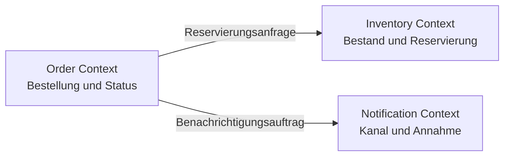

# M02: Servicegrenzen

## Vom laufenden Code zur begründeten Architektur

**Ergebnis:** Eine Context Map zeigt Verantwortungen, Datenhoheit und vertretbare Grenzen der Bestellplattform.

---

# Leitfragen

- Wann ist ein Monolith die bessere Ausgangsform?
- Welche Verantwortung gehört fachlich zusammen?
- Wer darf Daten ändern, und wer darf sie nur verwenden?
- Welche Änderungsgründe sprechen für eine eigene Grenze?

---

# Das mentale Modell

Eine Servicegrenze ist keine technische Ordnergrenze. Sie bündelt:

1. eine fachliche Verantwortung,
2. die Hoheit über zugehörige Daten,
3. Regeln, die gemeinsam geändert werden,
4. eine klar benannte Beziehung zu anderen Bereichen.

Die Context Map macht diese Bereiche und Beziehungen sichtbar. Sie ist eine begründete Arbeitshypothese, kein endgültiger Bauplan.

---

# Monolith und Microservices vergleichen

| Kriterium | Monolith | Microservices |
| --- | --- | --- |
| Änderungen | gemeinsamer Build und Roll-out | getrennte Änderungen möglich |
| Daten | direkte Transaktionen einfacher | Datenhoheit muss verteilt werden |
| Betrieb | ein Prozess, weniger Laufzeitgrenzen | mehrere Prozesse, Netz und Diagnose |
| Skalierung | Anwendung als Einheit | einzelne Lasttreiber getrennt skalierbar |
| Teamarbeit | Koordination im gemeinsamen Code | klare Verantwortung nötig |

Microservices sind vertretbar, wenn der Nutzen unabhängiger Änderung und Verantwortung die zusätzlichen Verteilungskosten überwiegt.

---

# Szenario: drei Fähigkeiten

Im laufenden Order Service sind drei fachliche Fähigkeiten erkennbar:

- Bestellung annehmen und Status führen,
- Bestand prüfen oder reservieren,
- Benachrichtigung anstoßen.

Die Namen allein beweisen noch keine Servicegrenzen. Entscheidend sind Regeln, Daten und Änderungsgründe.

---

# Verantwortung und Datenhoheit

| Fähigkeit | Eigene Entscheidungen | Mögliche eigene Daten |
| --- | --- | --- |
| Order | Annahme und Bestellstatus | Bestellung, Positionen, Status |
| Inventory | Verfügbarkeit und Reservierung | Bestand, Reservierung |
| Notification | Kanal und Annahme einer Nachricht | Zustellauftrag, Zustellstatus |

**Datenhoheit** bedeutet: Ein Bereich definiert Regeln und Schreibzugriff für seine Daten. Andere Bereiche erhalten Ergebnisse über einen Vertrag statt über gemeinsame Tabellen.

---

# Änderungsgründe als Grenztest

Fragen Sie für jede Fähigkeit:

- Ändert sie sich aus einem anderen fachlichen Grund?
- Benötigt sie einen anderen Release-Rhythmus?
- Hat sie ein eigenes Last- oder Ausfallprofil?
- Kann ein Team ihre Regeln vollständig verantworten?

Mehrere Ja-Antworten stützen eine Trennung. Ein einzelnes Framework, eine Tabelle oder ein Controller ist kein ausreichender Grund.

---

# Beispiel einer Context Map

Leserichtung: Order koordiniert den Bestellablauf. Inventory und Notification behalten ihre Regeln und Datenhoheit. Erwartet wird keine gemeinsame Datenbank als Integrationsvertrag.

---

# Gegenprobe: im Monolithen bleiben

Ein modularer Monolith bleibt plausibel, wenn:

- ein kleines Team alle Teile gemeinsam ändert,
- Anforderungen und Lastprofile ähnlich sind,
- atomare Transaktionen wichtiger als unabhängige Deployments sind,
- zusätzliche Laufzeit- und Diagnosegrenzen keinen messbaren Nutzen bringen.

Die Alternative zur schlechten Servicegrenze ist häufig ein klar modularisierter Monolith, nicht ein weiterer Service.

---

# Fehlerbild: geteilte Datenhoheit

Order und Inventory schreiben beide direkt in dieselbe Bestandsstruktur. Dadurch bleibt unklar:

- welche Regeln beim Schreiben gelten,
- welcher Bereich Fehler behebt,
- ob beide unabhängig geändert werden können,
- welcher Vertrag bei einer Trennung stabil bleiben muss.

Eine Linie im Diagramm beseitigt diese Kopplung nicht. Die Schreibverantwortung muss eindeutig sein.

---

# Checkpoint und Brücke

Eine Grenze ist belastbar, wenn Sie für jeden Kandidaten zeigen können:

- welche Fähigkeit er verantwortet,
- welche Daten nur er ändern darf,
- welcher Änderungsgrund die Trennung stützt,
- welche Kosten die Verteilung erzeugt,
- warum die gewählte Form besser als die Alternative ist.

**Nächster Schritt:** Diese Grenzen werden in M03 zu expliziten REST-Ressourcen und überprüfbaren Verträgen.