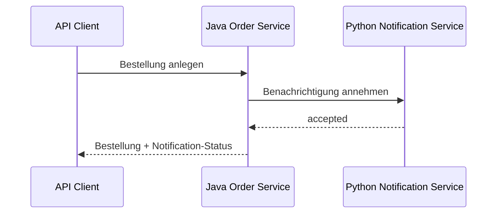

# M04: Java-Python-Integration

## Zwei Laufzeiten, ein expliziter Vertrag

**Ergebnis:** Der Java-Service nutzt den vorbereiteten FastAPI-Service im Erfolgs- und Ausfallfall vertragstreu.

**Basispfad:** 45 Minuten über Tag 1 und Tag 2. Python-Vorkenntnisse sind nicht erforderlich.

---

# Leitfragen

- Welche Informationen müssen beide Services gemeinsam verstehen?
- Wo endet die Fachlogik und wo beginnt der HTTP-Adapter?
- Wie wird Erfolg Ende zu Ende sichtbar?
- Wie bleibt ein Downstream-Ausfall ein stabiler API-Fehler?

---

# Das mentale Modell



Leserichtung: Java führt den Bestellpfad. Python ist ein vorbereiteter Service hinter einem HTTP-Vertrag. Gemeinsame Programmiersprache ist nicht nötig; gemeinsame Semantik ist nötig.

---

# Vertrag vor Implementierung

Der Notification Service veröffentlicht `GET /health` und `POST /notifications`. Der JSON-Request enthält `order_id`, `recipient` und optional `channel`; Annahme liefert `202`, Schema- oder Werteverletzung `422`.

Der Java-Client muss nur diesen Vertrag kennen, nicht FastAPI, Pydantic oder interne Python-Funktionen.

---

# Adapter an der Servicegrenze

**OrderApplicationService → NotificationClient → HTTP-Adapter → Notification API**

Die Anwendungslogik fordert eine Benachrichtigung an. Der Adapter übersetzt Java-Daten in JSON, führt HTTP aus und übersetzt Antwort oder Transportfehler zurück.

Diese Trennung hält Netzwerkdetails aus der Fachlogik heraus und macht beide Teile getrennt testbar.

---

# Konfiguration statt fester Adresse

Die Basisadresse des Notification Service wird über `notification.base-url` konfiguriert.

- nativ kann die Adresse auf einen lokalen Port zeigen,
- in Compose kann sie einen Service-Namen verwenden,
- Tests können einen kontrollierten Ersatzserver verwenden,
- Fachcode bleibt in allen Umgebungen gleich.

Eine fest codierte Host-Adresse würde Deployment und Test unnötig koppeln.

---

# Verifizierter Erfolgsfall

```json
{
  "sku": "SKU-100",
  "quantity": 2,
  "recipient": "dev@example.test"
}
```

Der geprüfte Ende-zu-Ende-Pfad liefert `201 Created`. Die Antwort enthält eine nicht leere `orderId`, den Bestellstatus `created` und `notificationStatus: accepted`.

Damit sind Transport, Feldabbildung und die Rückgabe an den ursprünglichen Client gemeinsam belegt.

---

# Downstream-Ausfall als öffentlicher Vertrag

Ist der Notification Service nicht erreichbar, wirft der Java-HTTP-Client einen Transportfehler. Der Adapter übersetzt ihn in eine anwendungsbezogene Ausnahme; die zentrale Fehlerbehandlung liefert:

```json
{
  "code": "DOWNSTREAM_UNAVAILABLE",
  "message": "Notification service is unavailable"
}
```

Der geprüfte HTTP-Status ist `502 Bad Gateway`. Interne Stacktraces oder Clientbibliotheksfehler gehören nicht in die öffentliche Antwort.

---

# Trade-off: synchroner Aufruf

Der direkte REST-Aufruf liefert sofort einen Notification-Status. Dafür übernimmt der Bestellpfad zeitliche Kopplung:

- der Downstream-Service muss erreichbar sein,
- Netzlatenz wird Teil der Antwortzeit,
- Fehlerabbildung ist Pflicht,
- Wiederholungen könnten doppelte Wirkungen erzeugen.

M04 macht diese Kopplung sichtbar. M05 vergleicht sie mit asynchronem Messaging.

---

# Keine Python-Voraussetzung

Im Basispfad wird der FastAPI-Service als ausführbarer Vertrag behandelt:

1. starten und Health prüfen,
2. veröffentlichte Operation prüfen,
3. aus Java aufrufen,
4. Erfolg und Ausfall beobachten.

Nur die optionale Erweiterung E05X verändert Python-Code. Sie ist keine Voraussetzung für spätere Pflichtmodule.

---

# Fehlerbild: Felder passen nicht zusammen

Java sendet `orderId`, der Python-Vertrag verlangt aber `order_id`. Ohne explizite Abbildung entsteht ein Validierungsfehler statt einer angenommenen Benachrichtigung.

Die Lösung ist keine lockere Parserkonfiguration. Request- und Response-Typen des Adapters bilden die veröffentlichten JSON-Namen bewusst ab und werden durch Vertragschecks geschützt.

---

# Checkpoint und Brücke

M04 ist abgeschlossen, wenn:

- der vorbereitete FastAPI-Service gesund antwortet,
- Java eine Benachrichtigung vertragstreu übermittelt,
- der Erfolg im Order-Response sichtbar ist,
- Nichtverfügbarkeit reproduzierbar als stabiler Fehler erscheint,
- Python-Code für den Basispfad unverändert bleiben kann.

**Nächster Schritt:** M05 entscheidet, welche Interaktionen synchron bleiben und welche durch Ereignisse entkoppelt werden.