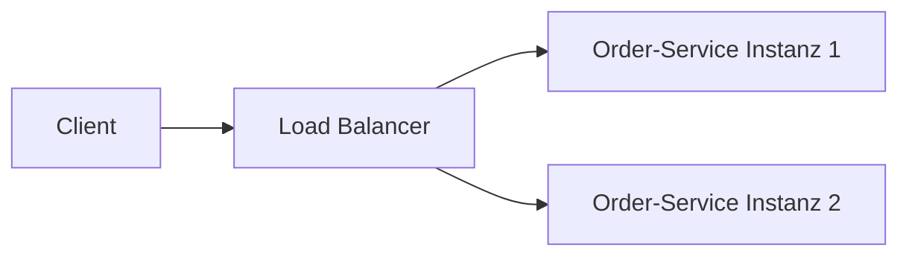

# Lab 1: Skalierung horizontal und vertikal einordnen

## Lernziel

Nach diesem Lab könnt ihr für ein gegebenes Lastszenario begründet entscheiden, ob horizontale oder vertikale Skalierung sinnvoller ist.

## Leitfragen

1. Was ist der Unterschied zwischen horizontaler und vertikaler Skalierung?
2. Welche Grenzen hat jede der beiden Varianten?
3. Wann lohnt sich Cloud-Skalierung gegenüber fester Kapazität?

## Vertikale Skalierung: mehr Ressourcen pro Instanz

Bei **vertikaler Skalierung** (scale up) bekommt eine einzelne Instanz mehr CPU, RAM oder schnelleren Speicher. Einfach umzusetzen, aber physikalisch und wirtschaftlich begrenzt - irgendwann gibt es keine größere Maschine mehr, und Ausfälle treffen die gesamte Kapazität auf einmal.

## Horizontale Skalierung: mehr Instanzen

Bei **horizontaler Skalierung** (scale out) laufen mehrere gleichwertige Instanzen desselben Service parallel, verteilt über einen Load Balancer. Erfordert, dass der Service **zustandslos** ist (kein lokal gehaltener Zustand, der zwischen Anfragen verloren gehen darf) oder dass der Zustand extern (z. B. in einer gemeinsamen Datenbank) liegt.

**Wichtige Einschränkung für unseren Kurs-Order-Service:** Die In-Memory-Speicherung aus Modul 2 ist **pro Prozess** getrennt. Zwei Instanzen sehen unterschiedliche Bestellungen - ein reales System bräuchte dafür eine gemeinsame Datenbank. Das ist im Lab 2 bewusst sichtbar und Teil der Diagnose, nicht verschwiegen.

## Wann lohnt sich Cloud-Skalierung?

Cloud-Umgebungen erlauben **Autoscaling**: Instanzen werden automatisch nach Lastmetriken (CPU, Anfragen/Sekunde) hinzugefügt oder entfernt. Das lohnt sich bei schwankender, schwer vorhersagbarer Last; bei gleichmäßiger, gut planbarer Last ist feste Kapazität oft günstiger und einfacher zu betreiben.

## Checkpoint

Ihr könnt für ein Lastszenario begründen, ob horizontale, vertikale oder Cloud-Autoscaling-Skalierung am besten passt.
