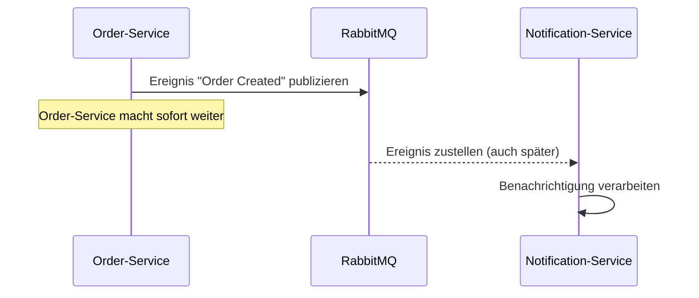

# Lab 1: Synchron vs. asynchron unterscheiden

## Lernziel

Nach diesem Lab könnt ihr synchrone und asynchrone Kommunikationsmuster unterscheiden und kennt die gängigsten Event-Driven-Architecture-Muster.

## Leitfragen

1. Was unterscheidet eine synchrone von einer asynchronen Interaktion?
2. Welche Rolle spielt ein Message Broker wie RabbitMQ dabei?
3. Welche EDA-Grundmuster gibt es?

## Synchrone Kommunikation

Bei einer **synchronen** Interaktion wartet der Aufrufer auf eine unmittelbare Antwort (z. B. ein REST-Aufruf `GET /orders/{id}`). Der Aufrufer blockiert, bis die Antwort da ist oder ein Timeout eintritt. Beide Seiten müssen zum Zeitpunkt des Aufrufs erreichbar sein.

## Asynchrone Kommunikation

Bei einer **asynchronen** Interaktion sendet der Aufrufer eine Nachricht und macht sofort weiter, ohne auf eine Antwort zu warten. Ein **Message Broker** (hier: RabbitMQ) nimmt die Nachricht entgegen, speichert sie und liefert sie an interessierte Empfänger aus - auch wenn diese im Moment des Sendens nicht erreichbar sind.

## Grundmuster der Event-Driven Architecture

| Muster | Kurzbeschreibung |
| --- | --- |
| Publish/Subscribe | Ein Sender veröffentlicht Ereignisse; beliebig viele Empfänger abonnieren sie, ohne dass der Sender sie kennt. |
| Event Notification | Ein schlankes Ereignis informiert nur "etwas ist passiert"; Details werden bei Bedarf separat nachgefragt. |
| Event-Carried State Transfer | Das Ereignis trägt bereits alle benötigten Daten, sodass der Empfänger keine Rückfrage braucht (unser Kursansatz für das Bestellereignis). |

## Checkpoint

Ihr könnt für ein gegebenes Beispiel entscheiden, ob es sich um synchrone oder asynchrone Kommunikation handelt, und ein passendes EDA-Muster benennen.
