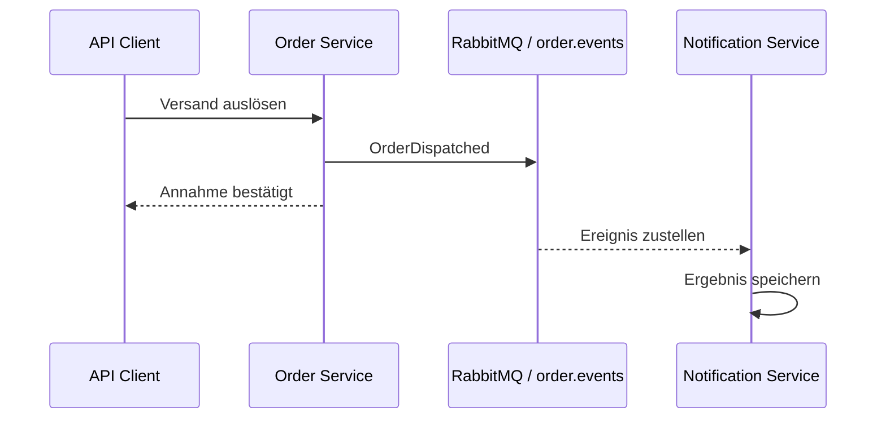

# M05: REST oder Ereignis

## Kommunikation nach Wirkung auswählen

**Ergebnis:** Für jede Interaktion liegt eine begründete REST- oder Messaging-Entscheidung vor; ein Bestellereignis wird über RabbitMQ veröffentlicht, konsumiert und im Fehlerfall untersucht.

---

# Leitfragen

- Benötigt der aufrufende Service sofort eine fachliche Antwort?
- Welche zeitliche Kopplung ist akzeptabel?
- Wann darf das Ergebnis verzögert konsistent werden?
- Wie wird ein Verarbeitungsfehler sichtbar und beherrschbar?

---

# Begriffe und mentales Modell

**REST:** synchroner Request-Response-Austausch mit unmittelbarer Antwort.

**Ereignis:** Aussage über etwas bereits Geschehenes, hier `OrderDispatched`.

**AMQP:** Protokoll für den Nachrichtenaustausch mit einem Broker. RabbitMQ nimmt Nachrichten an und stellt sie Queues zu.

**Temporal Coupling:** zeitliche Kopplung; Sender und Empfänger müssen gleichzeitig verfügbar sein.

**Eventual Consistency:** verzögerte Konsistenz; beteiligte Sichten stimmen nach erfolgreicher Verarbeitung wieder überein.

---

# Vier Entscheidungskriterien

| Kriterium | REST passt eher | Messaging passt eher |
| --- | --- | --- |
| Antwort | sofort fachlich benötigt | spätere Reaktion genügt |
| Verfügbarkeit | Empfänger muss jetzt laufen | Broker puffert zeitweise |
| Konsistenz | Ergebnis gehört in dieselbe Antwort | verzögerter Stand ist zulässig |
| Fehler | direkt an Aufrufer zurückgeben | separat beobachten und nachverarbeiten |

Messaging entfernt nicht jede Kopplung. Ereignisschema, Queue und Fehlerbehandlung bleiben gemeinsame Betriebsvereinbarungen.

---

# Szenario: Bestellung versendet

Die Bestellung wurde bereits synchron angelegt. Beim Versand veröffentlicht der Order Service eine Tatsache. Der Notification Service verarbeitet sie unabhängig vom HTTP-Aufruf.

Leserichtung: Die HTTP-Antwort bestätigt die Annahme des Versandbefehls. Sie bestätigt noch nicht die spätere Verarbeitung durch den Consumer.

---

# Producer, Queue und Consumer

Der **Producer** serialisiert `orderId`, `type` und `occurredAt` und sendet an `order.events`.

Die dauerhafte **Queue** hält Nachrichten zwischen Veröffentlichung und Verarbeitung.

Der **Consumer** liest das Ereignis, speichert das beobachtbare Ergebnis und bestätigt danach die Verarbeitung mit einem Acknowledgement.

Eine Bestätigung vor erfolgreicher Verarbeitung könnte eine Nachricht verlieren. Keine Bestätigung lässt sie unbestätigt und ermöglicht eine erneute Zustellung.

---

# Verifiziertes Verhalten

Im geprüften Referenzstand erzeugt eine gültige Bestellung einen Identifier. Der Dispatch-Endpunkt nimmt den Versand an, der Producer veröffentlicht `OrderDispatched`, und der Notification Service zeigt das Ereignis anschließend über seine Ereignisliste.

Der Smoke-Test wartet begrenzt auf denselben `orderId`. Damit wird nicht nur die Veröffentlichung, sondern auch die Verarbeitung durch den Consumer beobachtet.

---

# Konsistenzgrenze

Zwischen bestätigtem Dispatch und sichtbarem Consumer-Ergebnis existiert ein Zeitfenster. In diesem Fenster ist die Order-Seite weiter als die Notification-Sicht.

Das ist kein zufälliger Fehler, sondern die gewählte Konsistenzform. Fachlich muss geklärt sein, wie lange die Verzögerung tolerierbar ist und wie ein ausbleibendes Ergebnis erkannt wird.

---

# Fehler und erneute Zustellung

Der vorbereitete Fehlerfall unterbricht die Verarbeitung vor dem Acknowledgement. Die Nachricht bleibt unbestätigt und kann nach Wiederherstellung erneut zugestellt werden.

Beobachtet werden mindestens:

- Fehlermeldung des Consumers,
- fehlendes oder verzögertes Verarbeitungsergebnis,
- erneute Zustellung nach Wiederherstellung,
- genau ein fachlich akzeptables Endergebnis.

Redelivery bedeutet **mindestens einmal**, nicht automatisch genau einmal. Consumer müssen deshalb mögliche Duplikate fachlich berücksichtigen.

---

# Trade-off-Entscheidung dokumentieren

Eine belastbare Entscheidung nennt nicht nur die Technik:

> Für die Versandbenachrichtigung verwenden wir Messaging, weil der Bestellpfad keine sofortige Notification-Antwort benötigt. Verzögerte Konsistenz ist zulässig; dafür müssen Redelivery und Duplikate beherrscht werden.

Eine synchrone Preis- oder Verfügbarkeitsabfrage kann dagegen REST benötigen, wenn ohne unmittelbare Antwort keine korrekte Entscheidung möglich ist.

---

# Checkpoint und Brücke

M05 ist abgeschlossen, wenn:

- Interaktionen nach Antwortbedarf, Kopplung, Konsistenz und Fehlerverhalten klassifiziert sind,
- `OrderDispatched` über `order.events` veröffentlicht und konsumiert wird,
- das Consumer-Ergebnis für dieselbe Bestellung sichtbar ist,
- Fehler und erneute Zustellung nachvollziehbar dokumentiert sind,
- jede Kommunikationswahl einen Trade-off benennt.

**Nächster Schritt:** M06 baut und startet Java, Python und RabbitMQ als reproduzierbare Compose-Landschaft.