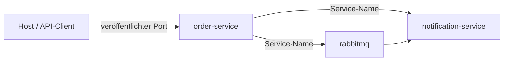

# M06: Docker Compose

## Nur das nötige Docker für die Lösung

**Ergebnis:** Java, Python und RabbitMQ werden als reproduzierbare Compose-Landschaft gebaut, gestartet, geprüft, diagnostiziert und kontrolliert beendet.

---

# Leitfragen

- Was wird als Image gebaut und was läuft als Container?
- Welche Adressen gelten vom Host und welche im Compose-Netzwerk?
- Wie zeigen Status, Healthchecks und Logs eine Ursache?
- Wie wird die Umgebung sauber beendet?

---

# Begriffe und mentales Modell

**Dockerfile:** reproduzierbare Bauanweisung für ein Image.

**Image:** unveränderliche Vorlage mit Anwendung und Laufzeit.

**Container:** laufende Instanz eines Images mit Konfiguration.

**Compose-Service:** deklarierte Rolle mit Image oder Build, Umgebung, Ports, Abhängigkeiten und Healthcheck.

Leserichtung: Der Host verwendet veröffentlichte Ports. Container sprechen sich im gemeinsamen Netzwerk über Service-Namen und Container-Ports an.

---

# Dockerfiles: bauen und laufen

Der Java-Service nutzt einen mehrstufigen Build: Maven baut und testet die Anwendung; das Laufzeit-Image enthält nur Java-Laufzeit, Artefakt und Health-Werkzeug.

Der Python-Service installiert festgelegte Abhängigkeiten, kopiert die Anwendung und startet Uvicorn. Beide Dockerfiles definieren einen Healthcheck am eigenen Service.

Das Ziel ist Nachvollziehbarkeit, nicht tiefe Layer-Optimierung.

---

# Ports und Service-Namen

Eine Portzuordnung verbindet **Host-Port : Container-Port**. Sie ist für Zugriffe vom Entwicklungsrechner nötig.

Innerhalb von Compose verwendet der Order Service dagegen `notification-service` und `rabbitmq`. `localhost` würde dort auf den eigenen Container zeigen.

Service-Namen sind damit Teil der Laufzeitkonfiguration, nicht der Fachlogik.

---

# Umgebungsvariablen

Compose übergibt die Basisadresse des Notification Service und die RabbitMQ-Verbindung an die Container. Lokale Werte werden aus der vorgesehenen Konfiguration bezogen und nicht in öffentliche Artefakte kopiert.

Ein Image bleibt dadurch gleich, während Adressen und Ports je Umgebung wechseln können.

---

# Healthchecks und Startreihenfolge

RabbitMQ meldet seine Bereitschaft mit einer Broker-Diagnose. Python prüft seinen Health-Endpunkt, Java den Actuator-Health-Endpunkt.

`depends_on` mit `service_healthy` verzögert abhängige Starts, bis die jeweilige Voraussetzung gesund ist. Ein gestarteter Prozess ist nicht automatisch ein betriebsbereiter Service.

---

# Der kleine Compose-Werkzeugkasten

- `docker compose config` rendert und prüft die effektive Konfiguration.
- `docker compose up --build --detach --wait` baut, startet und wartet auf Healthchecks.
- `docker compose ps` zeigt Zustand, Health und veröffentlichte Ports.
- `docker compose logs` verbindet Service-Ausgaben mit der Diagnose.
- `docker compose down --remove-orphans` beendet und entfernt die Kurslandschaft.

Diese Befehle beantworten unterschiedliche Fragen; Logs ersetzen keinen Statuscheck und ein grüner Status ersetzt keinen API-Smoke-Test.

---

# Verifiziertes Verhalten

Im geprüften Referenzstand werden RabbitMQ, Notification Service und Order Service gesund. Der Smoke-Test prüft anschließend:

1. Python-Health,
2. gültige Bestellung über Java und Python,
3. ungültige Bestellmenge als Grenzfall,
4. Dispatch und konsumiertes Ereignis.

Erst dieser Durchstich belegt, dass Build, Netzwerk, Konfiguration und Anwendung gemeinsam funktionieren.

---

# Diagnose statt Neustart auf Verdacht

Ein absichtlich falscher Service-Name erzeugt typischerweise einen Namens- oder Verbindungsfehler im aufrufenden Service. Ein belegter Host-Port erzeugt dagegen bereits beim Start eine Portfehlermeldung. Eine falsche Umgebungsvariable kann zu einem ungesunden, aber laufenden Container führen.

Diagnosereihenfolge:

1. effektive Konfiguration prüfen,
2. Status und Health lesen,
3. Logs des betroffenen und abhängigen Service vergleichen,
4. genau eine Ursache korrigieren,
5. erneut starten und den Smoke-Test wiederholen.

---

# Bewusste Grenze

M06 behandelt keine Image-Registry, keine Volumes, kein Kubernetes und keinen Monitoring-Stack. Diese Themen sind für den genehmigten Checkpoint nicht nötig.

Der Fokus bleibt auf Image, Container, Dockerfile, Ports, Umgebungsvariablen, Service-Namen, Netzwerk, Healthchecks und Compose-Diagnose.

---

# Checkpoint und Brücke

M06 ist abgeschlossen, wenn:

- Java- und Python-Images aus den vorhandenen Dockerfiles gebaut sind,
- Java, Python und RabbitMQ gesund laufen,
- Host-Ports und interne Service-Namen korrekt unterschieden werden,
- positiver, Grenz- und Messaging-Pfad beobachtbar sind,
- ein vorbereiteter Fehler mit Konfiguration, Status und Logs belegt wurde,
- die Landschaft kontrolliert entfernt ist.

**Nächster Schritt:** M07 nutzt diese reproduzierbare Umgebung für Tests und Resilienzdiagnosen.