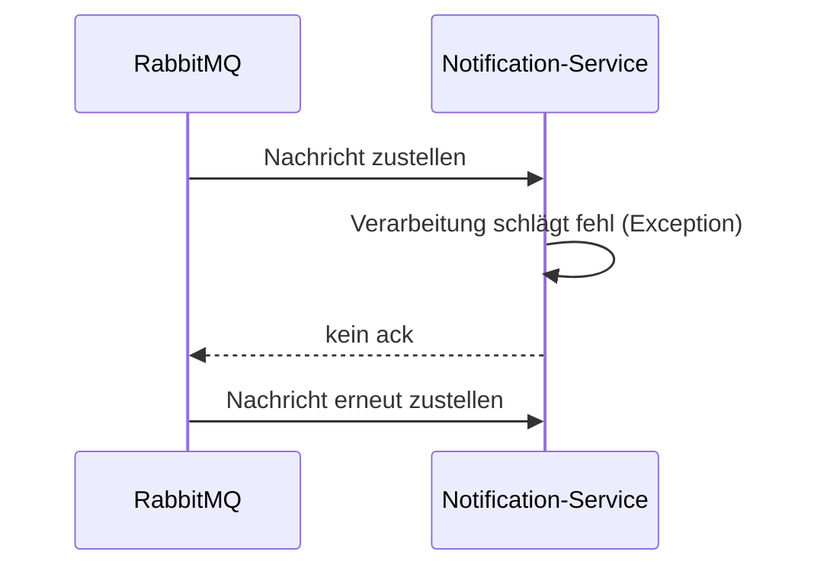

# Lab 3 (Java-Spur): End-to-End-Ereignisfluss testen und Fehlerfall betrachten

## Lernziel

Nach diesem Lab habt ihr den Ereignisfluss Order → RabbitMQ → Notification nachweislich getestet und wisst, was bei einem Verarbeitungsfehler beim Konsumenten passiert.

## Leitfragen

1. Wie testet man Consumer-Logik automatisiert, ohne eine echte RabbitMQ-Instanz im Test zu benötigen?
2. Was passiert, wenn `handleOrderCreated` eine Exception wirft?

## Consumer-Logik isoliert testen

Statt eines vollständigen Broker-Tests (aufwendig, benötigt eine laufende RabbitMQ-Instanz oder Testcontainer) testet ihr die **Verarbeitungslogik** direkt: Ihr ruft `handleOrderCreated` mit einem konstruierten `OrderCreatedEvent` auf und prüft, dass keine Exception geworfen wird.

```java
@Test
void handleOrderCreated_processesEventWithoutException() {
    OrderCreatedListener listener = new OrderCreatedListener();
    OrderEventPayload payload = new OrderEventPayload(
            "a3f1...", "Mara Beispiel", "Kaffeemaschine", 2, "NEW");
    OrderCreatedEvent event = new OrderCreatedEvent(payload);

    assertDoesNotThrow(() -> listener.handleOrderCreated(event));
}
```

Das ist ein bewusster Kompromiss: Der Test prüft die Verarbeitungslogik statisch nachvollziehbar, nicht die tatsächliche Netzwerkübertragung über RabbitMQ - diese wird stattdessen manuell (Lab 1/2) und über die Management-UI verifiziert.

## Fehlerfall: Exception im Listener

Wirft `handleOrderCreated` eine unbehandelte Exception, bestätigt Spring AMQP die Nachricht standardmäßig **nicht** (kein automatisches `ack`). RabbitMQ liefert die Nachricht daraufhin erneut aus - bei einem dauerhaften Fehler entsteht eine **Endlosschleife** aus Zustellung und Fehlschlag ("poison message").



## Ausblick: Retry-Strategie (Erweiterung)

Eine begrenzte Anzahl automatischer Wiederholungsversuche mit steigender Wartezeit (Exponential Backoff) verhindert Endlosschleifen. Spring AMQP unterstützt das über `RetryTemplate`-Konfiguration am `SimpleRabbitListenerContainerFactory`; nach Erschöpfen der Versuche landet die Nachricht üblicherweise in einer **Dead-Letter-Queue** zur manuellen Prüfung.

## Checkpoint

Ihr könnt die Consumer-Logik isoliert testen und erklären, was ohne Fehlerbehandlung bei einer dauerhaft fehlschlagenden Nachricht passiert.
