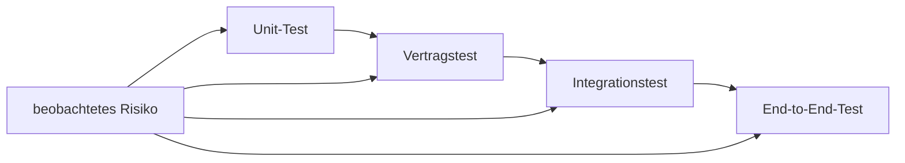

# M07: Tests und Resilienz

## Risiken sichtbar und Fehler begrenzt machen

**Ergebnis:** Eine relevante Testlücke ist geschlossen, der Vertrag über die Servicegrenze geprüft und ein Teilausfall reproduzierbar diagnostiziert. Eine begrenzte Kontrolle verbessert das Verhalten mit benanntem Trade-off.

---

# Leitfragen

- Welche Testart deckt welches Risiko mit vertretbarem Aufwand ab?
- Welche Evidenz trennt Symptom, Ursache und Wirkung?
- Wann helfen Timeout, begrenzte Wiederholung oder Idempotenz?
- Welche neue Gefahr führt eine Resilienzmaßnahme ein?

---

# Ein risikobasiertes Testmodell

| Risiko | Engste sinnvolle Testebene | Typischer Nachweis |
| --- | --- | --- |
| falsche Fachregel | Unit-Test | Rückgabe und Interaktion einer Klasse |
| Vertragsdrift | Vertragstest | Pfade, Methoden, Antworten und Schema stimmen überein |
| fehlerhafte Verbindung | Integrationstest | echte Servicegrenze liefert erwartetes Verhalten |
| gebrochener Gesamtfluss | End-to-End-Test | Nutzerfluss funktioniert über alle Komponenten |

Je breiter ein Test wird, desto realistischer, aber meist auch langsamer und störanfälliger ist er. Das Risiko entscheidet, nicht eine feste Testpyramide.

---

# Positiv, Grenze und Fehler

Ein belastbarer Satz prüft drei Perspektiven:

- **Positiv:** Eine gültige Bestellung wird erstellt und die Benachrichtigung akzeptiert.
- **Grenze:** Die kleinste ungültige Menge wird mit einem fachlich passenden Fehler abgelehnt.
- **Fehler:** Der Notification Service fällt aus; der Order Service liefert einen kontrollierten Downstream-Fehler.

Nur der positive Fall beweist nicht, dass ein System unter realistischen Bedingungen verständlich reagiert.

---

# Der Vertrag über die Grenze

Der veröffentlichte OpenAPI-Vertrag und das Laufzeitschema des FastAPI-Service müssen dieselben Operationen, Antworten und zentralen Einschränkungen enthalten.

Ein Vertragstest findet Drift früh. Ein Integrationstest ergänzt ihn: Er zeigt, ob Java und Python den Vertrag im laufenden System tatsächlich gleich interpretieren.

Leserichtung: Vom Risiko wird die engste Testebene gewählt, die den Fehler zuverlässig erkennen kann. Breitere Ebenen ergänzen, statt alle Details erneut zu prüfen.

---

# Verifizierter Referenzstand

Der geprüfte Kursstand enthält:

- Java-Unit-Tests für Bestellerstellung und Event-Publishing,
- FastAPI-Tests für Health, positiven Fall, Grenze und ungültigen Kanal,
- einen Vertragstest zwischen veröffentlichtem OpenAPI-Dokument und Laufzeitschema,
- einen Smoke-Test für Java, Python und RabbitMQ,
- einen belegten Teilausfall: Python ist nicht erreichbar, Java antwortet kontrolliert mit einem Downstream-Fehler.

Damit existiert eine Basis. M07 prüft, welches konkrete Risiko noch nicht ausreichend abgesichert ist.

---

# Fehlerdiagnose mit Evidenz

Beim vorbereiteten Teilausfall bleibt der Order Service erreichbar, während der Notification Service gestoppt ist.

Eine belastbare Diagnose verbindet:

1. reproduzierbares Testergebnis oder API-Verhalten,
2. Service-Status,
3. zeitlich passende Logs beider Seiten,
4. eine Ursache, die alle Beobachtungen erklärt.

Nach der Mittagspause wird derselbe Fall erneut ausgeführt. Erst die Wiederholung trennt einen reproduzierbaren Befund von einem einmaligen Zustand.

---

# Drei begrenzte Kontrollen

**Timeout:** Begrenzt, wie lange ein Aufruf Ressourcen bindet. Ein zu kurzer Wert erzeugt Fehlalarme; ein zu langer Wert verlängert Staus.

**Begrenzte Wiederholung:** Kann vorübergehende Fehler überbrücken. Sie braucht eine kleine Höchstzahl und darf Last oder Seiteneffekte nicht vervielfachen.

**Idempotenz:** Derselbe fachliche Auftrag wirkt höchstens einmal. Sie benötigt einen stabilen Schlüssel und gespeicherten Verarbeitungszustand.

Für einen schreibenden Aufruf ist blinde Wiederholung riskant: Die Antwort kann verloren gehen, obwohl die Gegenseite bereits verarbeitet hat.

---

# Bewusste Entscheidung

Im Basispfad wird ein expliziter Client-Timeout gewählt. Er passt zum beobachteten Downstream-Ausfall und begrenzt Wartezeit, ohne den POST automatisch zu wiederholen.

Idempotenz wäre die Voraussetzung für eine spätere sichere Wiederholungsstrategie. Sie ist eine valide Weiterentwicklung, aber keine versteckte Voraussetzung für M08.

---

# Checkpoint und Brücke

M07 ist abgeschlossen, wenn:

- eine Testlücke einem konkreten Risiko zugeordnet und geschlossen ist,
- positiver, Grenz- und Fehlerfall ausführbar sind,
- der Cross-Service-Vertrag geprüft ist,
- der Teilausfall vor und nach der Pause dieselbe Evidenz liefert,
- eine begrenzte Kontrolle getestet und ihr Trade-off begründet ist.

**Nächster Schritt:** M08 verwendet diese Evidenz für ein Produktionsreife-Review und einen priorisierten Verbesserungsplan.