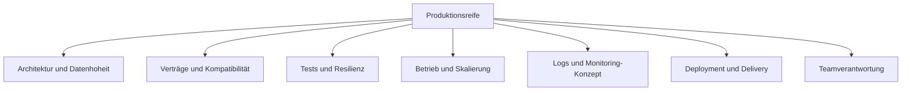

# M08: Skalierung, Delivery und Produktionsreife

## Vom funktionierenden System zum priorisierten nächsten Schritt

**Ergebnis:** Horizontale und vertikale Skalierung sind korrekt abgegrenzt. Ein individuelles Review bewertet technische und organisatorische Risiken und endet in einem priorisierten Verbesserungsplan mit konkretem Transfer.

---

# Leitfragen

- Was beweist eine zusätzliche lokale Instanz und was beweist sie nicht?
- Welche Dimensionen gehören zu Produktionsreife?
- Wie werden Risiken statt Wunschlisten priorisiert?
- Wer übernimmt welchen nächsten Schritt und welchen Nachweis?

---

# Zwei Skalierungsrichtungen

| Richtung | Veränderung | Stärke | Grenze |
| --- | --- | --- | --- |
| vertikal | mehr CPU oder Arbeitsspeicher für eine Instanz | einfacher Betriebsweg | harte Maschinen- und Kostenobergrenze |
| horizontal | mehr Instanzen derselben Rolle | Kapazität und Ausfallverteilung möglich | benötigt Verteilung, Zustandsstrategie und Betriebskontrolle |

Eine zweite Instanz allein ist noch kein Load Balancing. Ohne vorgeschaltete Verteilung erreicht ein Client weiterhin nur ein konkretes Ziel.
---

# Lokale Beobachtung mit Grenze

Die Compose-Landschaft kann den Versuch einer zusätzlichen Notification-Instanz sichtbar machen. Die feste Veröffentlichung desselben Host-Ports begrenzt diesen Versuch: Zwei Prozesse können nicht denselben Host-Port belegen.

Diese Beobachtung ist didaktisch nützlich, aber kein Lasttest und kein Produktionsnachweis. Für echte horizontale Skalierung wären unter anderem dynamische interne Instanzen, ein verteilter Einstiegspunkt, Health-Routing und messbare Lastkriterien nötig.

Cloud und Kubernetes bleiben außerhalb des praktischen Kursumfangs.
---

# Produktionsreife ist ein Systemmodell

Leserichtung: Keine einzelne Dimension macht das System produktionsreif. Ein Review sucht die größten zusammenhängenden Risiken und ihre Nachweise.

---

# Architektur und Verträge

Prüffragen:

- Sind Servicegrenzen, Verantwortung und Datenhoheit eindeutig?
- Sind REST- und Messaging-Entscheidungen anhand Kopplung und Konsistenz begründet?
- Ist der OpenAPI-Vertrag versioniert und kompatibel änderbar?
- Sind Fehlerantworten und Ereignisformate testbar?

Ein technisch erreichbarer Service ist noch kein stabiler Vertragspartner.
---

# Tests, Betrieb und Beobachtbarkeit

Tests werden nach Risiko gewählt. Health-Status und Logs liefern Betriebsindizien; ein Monitoring-Konzept ergänzt Ziele, Signale, Schwellen und Verantwortungen.

Der Kurs implementiert keinen Monitoring-Stack. Das Review beschreibt stattdessen:

- welche Serviceziele beobachtet werden sollen,
- welche Metriken, Logs oder Traces dafür nötig wären,
- wer auf Abweichungen reagiert,
- welcher Nachweis vor dem Roll-out fehlt.

Logging ohne Such- und Reaktionskonzept bleibt Datenproduktion ohne Betriebswirkung.

---

# Deployment-Strategien

**Rolling:** Instanzen werden schrittweise ersetzt. Ressourcenschonend, aber alte und neue Version laufen zeitweise gemeinsam.

**Blue/Green:** Zwei vollständige Stände erlauben schnellen Wechsel und Rücksprung. Dafür steigt der Ressourcen- und Synchronisationsaufwand.

**Canary:** Eine kleine Zielgruppe erhält die neue Version zuerst. Das begrenzt Risiko, verlangt aber Routing und aussagekräftige Signale.

Im Kurs werden Strategien bewertet, nicht implementiert.

---

# Agile Lieferung, CI/CD und DevOps

Kleine Änderungen reduzieren nur dann Risiko, wenn automatisierte Nachweise und klare Übergaben existieren.

Ein sinnvoller Fluss verbindet:

1. fachliche Akzeptanzkriterien,
2. Code- und Vertragsprüfung,
3. Tests und reproduzierbaren Build,
4. freigegebenes Deployment,
5. Beobachtung und Rückrollentscheidung.

Der Kurs baut keine CI-Pipeline. Das Review benennt erforderliche Gates, Artefakte und Verantwortungen.

---

# Team Ownership statt Übergabelücke

DevOps bedeutet hier keine neue Rolle, die alle Probleme übernimmt. Entwicklung und Betrieb teilen Verantwortung für Änderbarkeit und Laufzeitverhalten.

Jede priorisierte Maßnahme braucht:

- eine verantwortliche Rolle,
- einen überprüfbaren Nachweis,
- eine realistische Reihenfolge,
- eine Rückfall- oder Stop-Entscheidung.

Unklare Verantwortung ist selbst ein Produktionsrisiko.

---

# Priorisieren mit Risiko und Abhängigkeit

Eine einfache Bewertung nutzt Auswirkung, Eintrittswahrscheinlichkeit und fehlenden Nachweis. Zuerst kommen Maßnahmen, die ein hohes Risiko senken oder weitere sichere Schritte ermöglichen.

Ein Plan mit drei begründeten Schritten ist belastbarer als eine ungeordnete Wunschliste. Abhängigkeiten zwischen Architektur, Betrieb und Team werden sichtbar gemacht.

---

# Checkpoint und Transfer

M08 ist abgeschlossen, wenn:

- horizontale und vertikale Skalierung korrekt unterschieden sind,
- die lokale Zusatzinstanz mit Port- und Load-Balancing-Grenze eingeordnet ist,
- Architektur, Verträge, Tests, Betrieb, Beobachtbarkeit, Deployment, Delivery und Ownership bewertet sind,
- drei nächste Schritte priorisiert, begründet und Rollen zugeordnet sind,
- ein konkreter Transfertermin mit erwartetem Nachweis feststeht.

**Kursabschluss:** Aus einer laufenden Referenzlösung ist ein begründeter Weg zum nächsten Produktionscheckpoint entstanden.