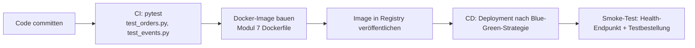

# Lösung (Python-Spur): Deployment-Strategien, DevOps und Abschlussdemonstration

## Aufgabe 1: Deployment-Strategie

**Empfehlung: Blue-Green Deployment.** Die Bestell-Plattform verarbeitet geschäftskritische Anfragen (Bestellannahme); ein fehlerhaftes Deployment darf die Verfügbarkeit nicht gefährden. Blue-Green erlaubt einen sofortigen Rollback durch Zurückschalten auf die vorherige, weiterhin laufende Version, ohne dass Nutzer eine fehlerhafte Übergangsphase bemerken. Der doppelte Ressourcenbedarf während der Umstellung ist bei einem Service dieser Größenordnung vertretbar.

Rolling Deployment wäre ebenfalls vertretbar, wenn Ressourcenkosten stärker im Vordergrund stehen und ein kurzzeitiger Parallelbetrieb zweier Versionen akzeptabel ist.

## Aufgabe 2: CI/CD-Pipeline (Skizze)



## Aufgabe 3: Gesamtsystem demonstrieren

```bash
docker compose up --build
```

Demonstrationsschritte:
1. Swagger UI öffnen (`http://localhost:8081/docs`), `POST /orders` über "Try it out" ausführen.
2. RabbitMQ-Management-UI (`http://localhost:15672`) öffnen, veröffentlichte Nachricht auf `order.events` zeigen.
3. `docker compose logs notification-service` zeigen, Benachrichtigungszeile mit derselben Bestell-ID vorweisen.

## Aufgabe 4: `capstone-summary.md` (Auszug)

```markdown
# Capstone-Zusammenfassung: Bestell-Plattform (Python-Spur)

## Lernziel 1: Microservices vs. Monolith, Servicegrenzen
Servicegrenzen für Order/Inventory/Notification begründet entworfen (Modul 1); Order-Service vollständig implementiert.

## Lernziel 2: RESTful API mit OpenAPI/Swagger
Contract-first mit `order-api.yaml`, vollständige CRUD-API mit `camelCase`-Alias-Konfiguration, validiert, dokumentiert über FastAPIs automatische Swagger UI, Client generiert (Modul 2/3).

## Lernziel 3: Skalierungsentscheidungen
Horizontale Skalierung mit Load Balancer beobachtet, Grenzen der In-Memory-Speicherung erkannt, Cloud-Optionen dokumentiert (Modul 4).

## Lernziel 4: Asynchrone Kommunikation mit RabbitMQ
Ereignisvertrag entworfen, Order-Service publiziert, Notification-Service konsumiert, Fehlerfall verstanden (Modul 5/6).

## Lernziel 5: Containerisieren und Orchestrieren
Schlanke Dockerfiles, vollständiger Stack über Docker Compose mit Healthchecks (Modul 7/8).

## Lernziel 6: Tests, Resilienz, Deployment
Testarten zugeordnet, Retry-Muster implementiert und automatisiert getestet, Monitoring-Konzept skizziert, Deployment-Strategie begründet gewählt (Modul 9).
```

Jeder Punkt bezieht sich auf tatsächliche Dateinamen und eigene Beobachtungen aus dem Projekt, nicht auf eine abstrakte Wiederholung der Lernziele.
